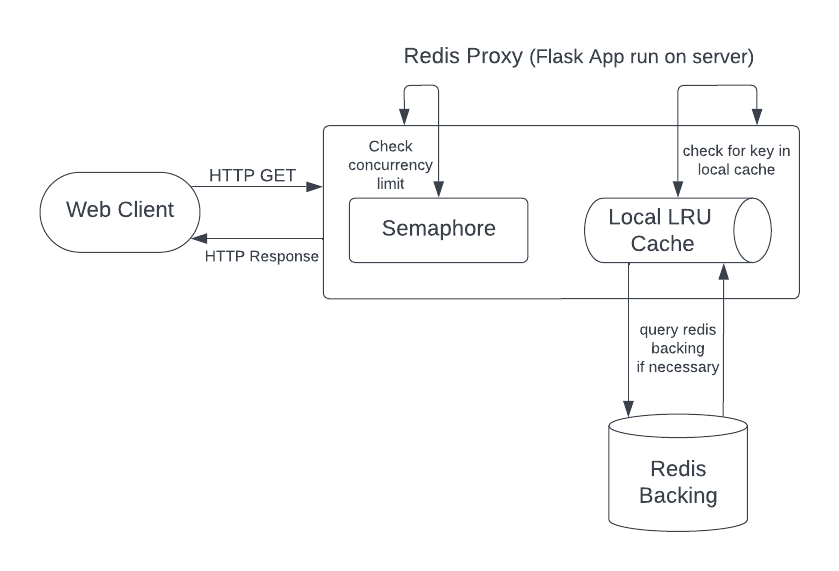

# Redis-Proxy
A transparent Redis proxy as an HTTP web service.

## Architecture


## Workflow and Code Walkthrough

1. **User Clients**:
   - Users send HTTP GET requests to the Redis-Proxy via the specified (or default Proxy host in docker-compose.yml) to get the values associated with specific keys.

2. **Redis Proxy (Flask Application)**:
   - Hosted on a server and listens for incoming HTTP requests on a specified IP address and port.
   - A local cache is created that stores key-value pairs.
      - During initialization, a Redis backing instance is created for the local cache.
   - A Semaphore is initialized to limit the number of concurrent client connections.
   - If a key is found in the local cache, it returns the value to the client in JSON format.
   - If a key is not found in the local cache (either due to eviction or never initially being set), it queries the Backing Redis instance.
   - The Redis backing produces the key if it exists in the instance and backfills the key-value pair in the local cache (possibly evicting the least recent item).

3. **Semaphore Check**:
   - If the Semaphore permits, the process moves to the next step.
   - If the Semaphore does not permit because the maximum number of concurrent clients is reached, the Redis Proxy sends a 429 'Too Many Requests' HTTP status code back to the client.

4. **Local Cache**:
   - An OrderedDict from the collections module is used to store key-value pairs.
      - Internally this is using a doubly linked list as the value in the key-value pair to make all dictionary operations constant while having knowledge of the ordering.
   - It has a specified capacity and expiry time for keys at initialization which are configurable through the docker-compose.yml.
   - Least Recently Used (LRU) eviction is used to remove old keys when the cache reaches its capacity.

5. **Backing Redis Instance**:
   - If a key is not found in the local cache, the Redis-Proxy queries the Backing Redis instance for the key.
   - The Backing Redis instance returns the value of the key to the Redis-Proxy if it exists.

6. **Response to User Clients**:
   - The Redis-Proxy responds to the user clients with the value of the key if found.
   - If the key is not found in both the local cache and the Backing Redis instance, it responds with a 204 status code.

## Cache

### Consideration for Local Cache Implementation
After a bit of deliberation, three general paths emerged for implementing the local cache, each with its own level of granularity and control over details.

1. **Dictionary with a Doubly Linked List**:
   This approach is the most granular and would require us to define our own Node class with references to the previous and next nodes. Using this definition, we would manage a doubly linked list to keep track of the order of access for eviction purposes. A separate dictionary would hold the actual key-value pairs. This approach provides the most control but requires a significant amount of manual management and additional code to ensure correct behavior, which could potentially introduce bugs or maintenance challenges.

2. **Ordered Dictionary**:
   Utilizing Python's `collections.OrderedDict` provides a middle ground. The OrderedDict maintains the order of keys based on when they were last accessed, which simplifies the implementation of LRU eviction. For global expiry, timestamps would be stored alongside the values, and a routine would check these timestamps whenever a key is accessed to see if the value has expired. This approach is straightforward, doesn't introduce additional dependencies, and requires less manual management compared to the first approach.

3. **Third-Party Dependencies: `redis_cache.RedisCache` and `functools.lru_cache`**:
   Leveraging third-party libraries can significantly simplify the implementation of the caching layer. These libraries abstract away the lower-level details and provide a higher-level, more convenient interface to work with caching. With that said, the major cons lie in needing to manage the dependency versioning and any bugs it may present. In addition, control and customization to specific needs are sacrificed for ease of use.

**Conclusion**: I chose to go the route of implementing my own OrderedDict since it allowed me to have a suitable level of control for future iterations of the project without requiring most of my development efforts to go towards managing the local cache class.

### Local Cache Implementation

The local cache uses Python's `OrderedDict` from the collections module. The `OrderedDict` provides the ability to keep the order of entries based on when they were added which is essential for the implementation of the Least Recently Used (LRU) caching mechanism.

Here's how the local cache operates:

1. **Initialization**:
   - Upon initialization, a new `OrderedDict` instance `self.local_cache` is created to serve as the local cache.
   - Environment variables are utilized to set the cache's `expiry_time` and `capacity`, defaulting to 300 seconds and 1000 keys respectively.
   - A lock object `self.lock` is also instantiated to ensure

2. **Cache Retrieval**:
   - The `get` method is utilized for cache retrieval. It employs a lock to ensure each thread is not interacting with eachother's cache during the process.
   - Upon a cache retrieval request, it first checks if the key exists in the local cache and if the data has not expired. If both conditions are true, the data is returned to the client.
   - The method uses `self.local_cache.pop(key)` to remove the item and re-inserts it to update its position in the order, reflecting its recent usage.

3. **Cache Update**:
   - If the item is not found in the local cache or is expired, the method checks the backing Redis instance.
   - Upon retrieval from Redis, the item is then inserted into the local cache, and the timestamp is updated to the current time.

4. **Cache Eviction**:
   - The `_ensure_cache_size` method is responsible for maintaining the cache size within the specified capacity.
   - If the cache size exceeds the specified capacity, it evicts the least recently used items by removing entries from the `OrderedDict` until the cache size is back within capacity.

## Algorithmic Complexity of Cache Operations

### 1. Inserting an Item - `O(1)`:
- Utilizing `OrderedDict`, which is simply a Dictoinary with a doubly linked list, inserting an item into the cache is a constant time complexity operation.

### 2. Retrieving an Item - `O(1)`:
- Retrieving an item, due to hashing, is also a constant time operation. In the extremly rare case of a hash collision, complexity could be reduced to `O(n)`.

### 3. Evicting an Item - `O(1)`:
- Evicting the least recently used item is achieved using `popitem(last = False)` method of `OrderedDict`, ensuring a constant time operation.

### Space Complexity (`O(n)`):
- The space complexity is primarily determined by the cache capacity (`n`). This encompasses the storage of keys, values, and timestamps for each item.

The design ensures efficient cache operations while achieving thread safety and controlled concurrent client access.

## Instructions for Running the Proxy and Tests

### Prerequisites
- Ensure you have the following software installed on your system:
  - `docker`
  - `docker-compose`
  - `make`

### Running the Proxy
1. Clone the repository to your local machine or `run tar -xzvf assignment.tar.gz`.
2. Navigate to the project directory: `tar -xzvf assignment.tar.gz`.
3. To start the proxy, run the following command in your terminal:
   ```bash
   make run

### Running Tests
1. Make sure you completed the previous two steps in the 'Running the Proxy' section.
2. To exectute the tests run the following in the project directory:
   ```bash
   make test

### Configurations
Modify the following environment variables within the `docker-compose.yml` file:
- `PROXY_HOST`: The host IP address for the proxy (default: '0.0.0.0').
- `PROXY_PORT`: The port the proxy listens on (default: 8000).
- `REDIS_HOST`: The host IP address for the Redis instance (default: 'localhost').
- `REDIS_PORT`: The port the Redis instance listens on (default: 6379).
- `CACHE_EXPIRY_TIME`: The cache expiry time in seconds (default: 300).
- `CACHE_CAPACITY`: The maximum number of keys the cache can hold (default: 1000).
- `MAX_CLIENTS`: The maximum number of concurrent clients the proxy can serve (default: 20).

## Requirements Not Implemented
The only requirement that I did not fulfill is the bonus requirement of 'Redis client protocol'. The reason was mostly due to the added complexity and reconfiguration of my application that would need to be involved. As I researched the work that would be involved, I realized that it requires a deep understanding of the protocol itself, which could be complex and time-consuming to learn. Lastly, I don't think the added value of having this feature was worth the time and effort involved in implementing it, a trade-off I weighed carefully in order to spend more time having a clean and useful README instead.

## Time per Section
Some of the major bottlenecks in my time efficiency were having to configure a Container from scratch, research Flask and Redis, writing robust tests, and keeping a comprehensive README.
- HTTP web service: 30 mins
- Single backing Redis: 30 mins
- Cached Get: 40 mins
- Global expiry: 20 mins
- LRU eviction: 1 hour
- Fixed key size: 20 mins
- Sequential concurrent processing: Omit since I did Parallel concurrent processing
- Configuration: 30 mins
- System tests: 2.5 hours
- Platform/ Single click and test: 1 hour 
- Documentation: 3 hours
- Parallel concurrent processing: 1.5 hours
- Concurrent client limit: 1 hour

Total: Roughly 13 hours spread over 4 days.

## Consideration for Deployment
When deploying a Flask application to a production environment, it's best to use a WSGI (Web Server Gateway Interface) server along with a web server. This is because Flask's built-in server does not handle concurrency well and isn't optimized for performance or security which are essential in production. 

A simple WSGI to get started with is Gunicorn, however, technologies like Nginx and Apache can further help to distribute client requests and manage SSL/TLS for HTTPS communication.

## Sources
[Redis Commands](https://redis.io/commands)
[Flask Documentation](https://flask.palletsprojects.com/en/3.0.x/)
[Flask Quickstart - HTML Escaping](https://flask.palletsprojects.com/en/3.0.x/quickstart/#html-escaping)
[Flask Quickstart - HTTP Methods](https://flask.palletsprojects.com/en/3.0.x/quickstart/#http-methods)
[Python Documentation](https://docs.python.org/3.11/)
[Python Collections - OrderedDict](https://docs.python.org/3/library/collections.html#collections.OrderedDict)
[Python Unittest Documentation](https://docs.python.org/3/library/unittest.html)
[Python Logging Documentation](https://docs.python.org/3/library/logging.html)
[Python Concurrent Futures - ThreadPoolExecutor](https://docs.python.org/3/library/concurrent.futures.html#concurrent.futures.ThreadPoolExecutor)
[Requests Library on PyPi](https://pypi.org/project/requests/)
[StackOverflow - Difference between StrictRedis and Redis](https://stackoverflow.com/questions/19021765/redis-py-whats-the-difference-between-strictredis-and-redis)
[StackOverflow - Difference between Lock and RLock](https://stackoverflow.com/questions/22885775/what-is-the-difference-between-lock-and-rlock)
[StackOverflow - Semaphores on Python](https://stackoverflow.com/questions/31508574/semaphores-on-python)
[CS StackExchange - How to trigger a thread to start working using semaphore](https://cs.stackexchange.com/questions/126814/how-to-trigger-a-thread-to-start-working-using-semaphore)
